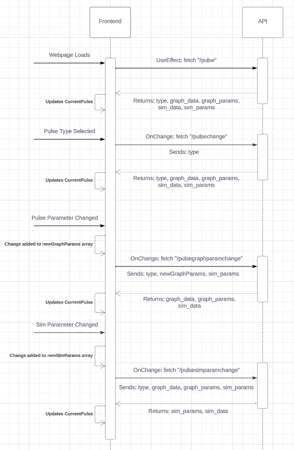

# MR-Pulse-REST

### Purpose

This project is a Spring/Summer 2023 independent study project at the University of Minnesota created by Madeline McGinnis and faculty member Patrick Bolan

It seeks to create an accessible MRI radiofrency pulse graphing website for students and professionals seeking to optimize these pulses. It prioritizes interactivity and facilitating rapid experimentation to promote understanding of MRI radiofrequency pulses.

### Resources

Our project is currently hosted at: https://simulate-my-mri-pulse.onrender.com/

UML Interaction Diagram:   

### Running Project

See /client README instructions, then /api README instructions to run the project locally
